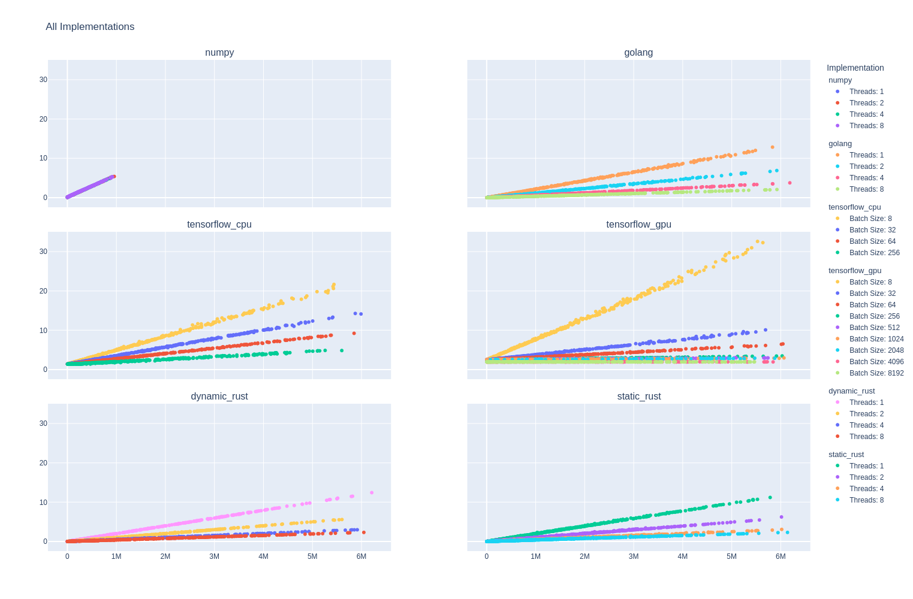
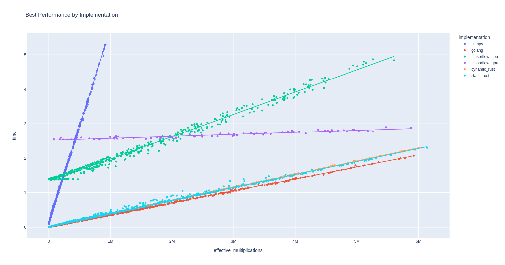

# Linear Algebra Profiling
## Hayden McAlister

This project looks into different implementations of a very simple program. Each implementation will, for various numbers of vectors, multiply each vector by a matrix various numbers of times, applying a nonlinear transformation (the heaviside function) after each multiplication. By altering the number of vectors, number of multiplications, and other factors such as number of threads, we can build a dataset that tells us how each implementation handles this task.

The goal overall is to analyze this data to best select a language for this task - taking into account the time we investigate here as well as factors such as ease of development.



### Structure

#### Dashboard

The main visualization tool, developed using plotly and dash.  To view the dashboard, pull this repo, install the requirements and run the server using 

```bash
cd Dashboard
pip install -r dash-requirements.txt
python main.py
```

Open the URL given by the script in your webbrowser to view the dashboard.



#### Implementations
The `Implementations` directory holds subdirectories, each of which is a different implementation of the above task. Implementations all accept common command line arguments (for the sake of consistency), which are:

- `trials`:
    Number of trials to attempt

- `multiplications`: 
    Number of multiplications per trial

- `threads`: 
    Number of threads to use

Note the Tensorflow implementation also accepts a batchsize argument, and does not tend to play nicely with threading (especially on the GPU).

Each implementation subdirectory also holds a `.csv` file that contains data on the profiling from that implementation. This data is collected, cleaned, and collated in the `Data Cleaning` directory.

#### Data Cleaning

The `Data Cleaning` directory contains `main.ipynb` - a jupyter notebook that reads each implementation `.csv` file, ensures the data is valid, melts all individual implementation data into a single dataframe, and performs some basic analysis on it to investigate relationships. This notebook also holds a lot of visualizations of the data along with some discussion - if you just want to have a peek at what's involved, start here!

### Motivation

My Masters project is looking into properties of the Hopfield network. The above definition (`heaviside(matrix * vector)`) is effectively the simplest Hopfield network implementation - so in effect we are profiling the Hopfield network!